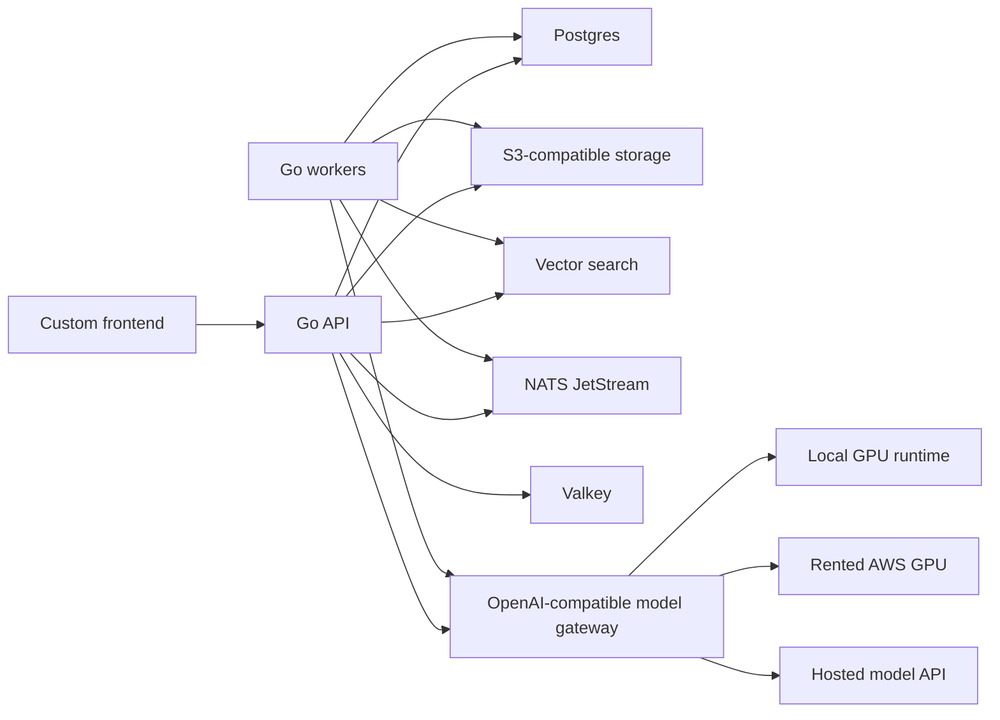

# Architecture

## Core Idea

The application should own product behavior, tenant state, documents, conversations, jobs, and permissions. It should not own a hard dependency on one cloud, one GPU runtime, or one LLM provider.

## Why This Shape

- The app can run on your NAS plus desktop GPU today.
- A future customer can run the same app with their own hardware.
- AWS GPU rental is an implementation detail, not an app rewrite.
- The frontend stays product-specific while the backend stays provider-portable.

## Backend Services

- API service: auth, tenants, conversations, documents, admin surfaces, request orchestration.
- Worker service: ingestion, embeddings, document processing, evaluations, long-running AI jobs.
- Model gateway: OpenAI-compatible HTTP boundary for vLLM, Ollama, LiteLLM, or remote model APIs.

## Data Services

- Postgres: users, tenants, conversations, messages, document metadata, jobs, audit events, and future policy state.
- Qdrant: vector search when scale and recall matter.
- MinIO: local S3-compatible document storage.
- NATS JetStream: durable job queue and progress events.
- Valkey: rate limits, short-lived cache, locks.

## First Principle

Every non-product dependency should sit behind a provider interface. That keeps the system movable from NAS to desktop to AWS to customer-owned hardware.

## Product Direction

Nexus Local should grow from private document search into a secure AI operations layer. See [Product Vision](product-vision.md) for the customer scenarios, trust requirements, and agent direction that guide architectural choices.
